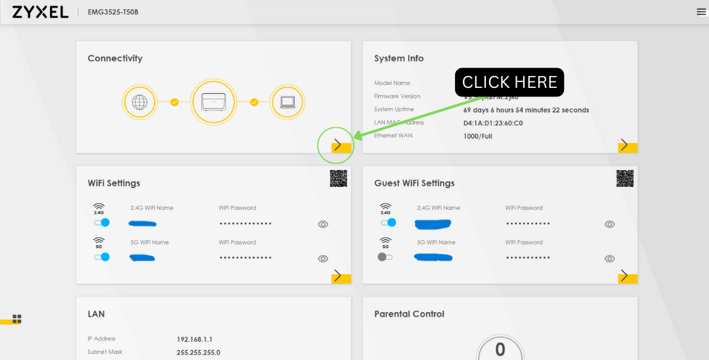
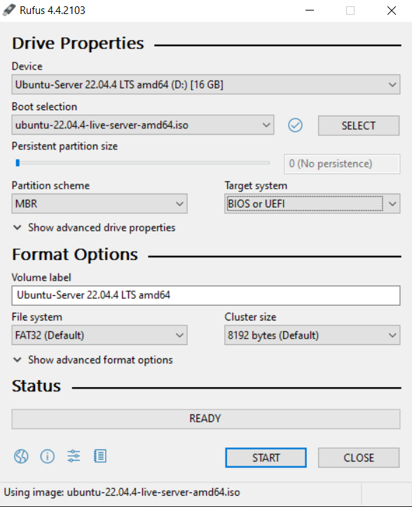

# Ubuntu  Server Setup

## Introduction

The following project focuses on repurposing an old computer into a network storage device using Ubuntu Server and Samba, while also transforming it into a downloading box with software like JDownloader 2 for direct downloads and QBittorrent for torrent downloads.

There are many reasons to want your own server. My primary reason is storage; I constantly run out of storage on my main device so instead of formatting my device every few months, I plan to download everything I need onto my server and use it as I please.

## Preparation

#### What you will be needing:
    
HARDWARE
- An old PC or Laptop
- Another PC or Laptop you will be sshing into the server from
- An ethernet cable for your old device (This is recommend to keep a stable internet connection for your server) 
- A flash drive (If you want to use a flash drive as your bootdrive you will need two flash drives)

SOFTWARE

#### Use the software you are comfortable with. Since this document covers Ubuntu Server that is the OS we will be using. For USB boot software I have only used Rufus, but a quick Google search recommended me these alternatives. You don't have to use the same software as me but expect my setup to be different from yours if you do.

- A copy of Ubuntu Server or you choice of OS. [LINK](https://ubuntu.com/download/server)
- A copy of utility software to create bootable USB drives. 
  - For WINDOWS I recommend Rufus. [LINK](https://rufus.ie/en/)
  - For LINUX it is recommend that you use VENTOY. [LINK](https://www.ventoy.net/en/download.html)
  - For MAC OS it is recommend that you use ETCHER. [LINK](https://etcher.balena.io/#download-etcher)

NETWORK

#### You need to reserve an IP address (DCHP) for your server. To do that you need to have the mac address.

#### The follwing instructions are for the ZYXEL Router. 

FINDING THE MAC ADDRESS:
1. Open a brower and enter your IP address. 
   1. To find your IP address on a window machine open command promt and type "ipconfig".
   2. You are looking for the "Default Gateway". It is generally 192.168.1.1
2. Login to your router. (the password and username on the back of the router) 
3. Click on "CONNECTIVITY", find the server MAC address. **NOTE: For this to work the device you are planning on turning into your sever needs to be connected to the network** 
4. If the device is on and connected to the network it should appear here. If it is connected via WiFi check the "WiFi" Page, if it is wired check the "Wired" Page.

SETTING THE STATIC IP:

5. Click on the 3 horizontal lines in the corner.
5. Click on "NETWORK SETTING" > "HOME NETWORK" > "STATIC DHCP".
6. Click on "+ STATIC DHCP CONFIGURATION". 
7. The only things you are chaning are:
   1. Add the MAC Address to the inputbox next to "MAC ADDRESS".
   2. Add your chosen IP address to the inputbox next to "IP ADDRESS". **NOTE: Only change the last 3 digits of the IP leave the rest as is**

### USE THE FOLLOWING IMAGES AS A VISUAL GUIDE
#### GETTING YOUR IP ADDRESS

#### FINDING DEVICE MAC ADDRESS

#### GETTING TO STATIC DHCP

#### ADDING STATIC DHCP

## Setup

### Overview of Steps

#### - Step 1: Create a Bootable USB Drive
#### - Step 2: Installing and Configuring Ubuntu Server
#### - Step 3: Setting up and Configuring Samba

### STEP 1: CREATE A BOOTABLE USB (USING RUFUS)

#### I would recommend you keep all the default the same. You can change the name of the flash drive by changing the text under 'VOLUME LABLE'.

#### Process for windows:
1. Run the Rufus exe
2. Under 'DEVICE' select your flash drive
3. Under 'BOOT SELECTION' keep it on 'ISO IMAGE'
4. Click on 'SELECT' next to 'Boot selection'
5. Select the OS you want to use and click 'OPEN' **YOU NEED TO HAVE AN ISO COPY OF THE SOFTWARE ON YOUR MACHINE**
6. 'PARTITION SCHEME' depends on the scheme of your hard drive you are going to install it on. I recommend leaving it as default.
7. 'TARGET SYSTEM' depends on your motherboard if you have an old motherboard I recommend leaving it as default.
8. Click on 'START' to start the process.
9. If you get the POPUP 'ISO HYBRID IMAGE DETECTED' just use the recommened option.

 

  ISO HYBRID POP UP

 

 
 

  Completed Rufus Setup

 

### STEP 2: Install Ubuntu Server on your chosen device

**Note: The installation process will wipe the device you choose to install the OS on. BACKUP ANY DATA BEFORE CONTINUING**

1. Plug the flash drive with the chosen OS on it into your old device. If you are planing on installing your chosen OS on a flash drive plug in the other flash drive as well. 
2. Start Up the device and boot into the BIOS.
3. Set the boot device to your flash drive with the OS on it (Some BIOS's will allow you to select the boot device without going futher into the BIOS by pressing F12. Check if your BIOS allows this.). Continue the Start Up process.
4. When it fully boots up you should see the following screen. Select "Try or Install Ubuntu Server".
5. Select your prefered language